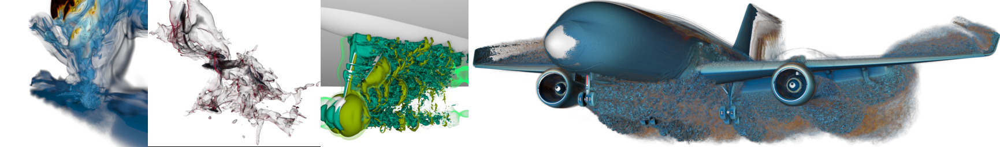
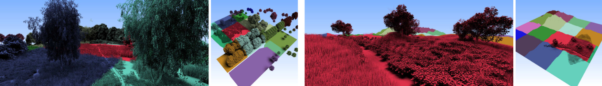

# OWL: A Productivity Library for OptiX

<!--- ------------------------------------------------------- -->
## What is OWL?

OWL is a convenience/productivity-oriented library on top of OptiX
(version 7 and newer), and aims at making it easier to write OptiX
programs by taking some of the more arcane parts of that job (like
knowing what a Shader Binding Table is, and how to actually build it),
and allowing the user to do that in a much, much simpler way. For
example, assuming the node graph (ie, the programs, geometries, and
acceleration structures) have already been built, the shader binding
table (SBT) can be built and properly populated by a single call
`owlBuildSBT(context)`.

In addition, OWL also allows for somewhat higher-level abstractions
than native OptiX+CUDA for operations such as creating device buffers,
uploading data, building shader programs and pipelines, building
acceleration structures, etc.

## Who is OWL designed/intended for?

OWL is particularly targetted at two groups of users: First, those
that do want to use GPU Ray Tracing and RTX hardware acceleration, and
that are comfortable with typical GPU concepts such as GPU memory vs
device memory, ray tracing pipeline, shader programs, and some CUDA
programming - but that are *not* "Ninja" OptiX/Vulkan/DirectX users,
and might not be 100% sure about the most nitty-bitty grits of details
on SBT data layout and order, or on just how exactly to do the BVH
compaction, how exactly to deal with async launches or refitting, etc.

Second, it targets those that *do* know all these concepts, but would
rather spent their time on the actual shader programs and
functionality of the program, rather than on doing and all the
low-level steps themselves; ie, those that are willing to trade a bit
of low-level control (and *maybe* some tiny amount of performance) for
higher developing productivity.

## Simple Example

As an example of how easy it is to use OWL to build OptiX data
strucutres, the following example code snippet takes a host-based
triangle mesh and:

- uploads the index and vertex buffer to the active GPU(s)
- creates a triangle mesh geometry with a sample 'color' SBT entry
- puts this mesh into a triangle bottom-level accel structure (BLAS)
- builds that acceleration structure, including BVH compaction
- creates an instance with an instance transform, and finally
- builds and returns an instance acceleration structure over that.

Note how this little example will do these step: including data
upload, set-up of build inputs, BVH construction, BVH compaction, and
everything else that's required for this. Though still a relatively
benign example, doing the same in low-level CUDA and OptiX code would
result in significantly more code that the user would have to write,
debug, and maintain.

    /* simple sample of setting up a full geometry, BLAS and
	   IAS for a simple single-triangle mesh model */
    OWLGroup buildBlasAndIas(mat3x4f             &instXfm,
	                         std::vector<float3> &vtx,
	                         std::vector<int3>   &idx,
							 float3               color)
	{
	   /* upload the buffers */
	   OWLBuffer vtxBuffer
	      = owlDeviceBufferCreate(ctx,OWL_FLOAT3,
		                          vtx.size(),vtx.data());
	   OWLBuffer idxBuffer
	      = owlDeviceBufferCreate(ctx,OWL_INT3,
		                          idx.size(),idx.data());

	   /* create triangle mesh geometry */
	   OWLGeom mesh = owlGeomCreate(ctx,myMeshGT);
	   owlTrianglesSetVertices(mesh,vtxBuffer,vtx.size(),
	                          /*stride+ofs*/sizeof(vtx[0],0);
	   owlTrianglesSetIndices(mesh,vtxBuffer,vtx.size(),
	                          /*stride+ofs*/sizeof(idx[0]),0);

	   /* create and build triangle BLAS */
	   OWLGroup blas = owlTrianglesGroupCreate(ctx,1,&mesh);
	   owlGroupBuildAccel(blas);

	   /* create and build instance accel struct (IAS) */
	   OWLGroup ias = owlInstanceGroupCreate(ctx,1,
	       /* instantiated BLASes */&blas,
	       /* instance IDs:       */nullptr,
		   /* instance transforms */&instXfm);
	   owlGroupBuildAccel(ias);
	   return blas; // that's it!
	}

Of course, even with OWL there's still much more that needs to be done
for a full renderer: For example, in this code we assumed that a
context (`ctx`) and a geometry type for this mesh (`myMeshGT`) have
already been created; the user also still has to set up the programs,
create frame buffer and launch data, build the programs
(`owlBuildPrograms()`), the pipline (`owlBuildPipeline()`), and the
SBT (`owlBuildSBT(ctx)`), etc.

## What about Advanced Users?

As stated above, OWL explicitly aims for helping entry-level or casual
RTX users get started, and get working productively with OptiX and RTX
without having to first become an OptiX "Ninja".

However, that is not to mean that it is *only* useful for beginners.
In fact, OWL currently supports lots of rather advanced features as
well, including, for example:
- multi-level instancing
- accel structure refitting (compaction is always on)
- multiple raygen programs and multiple ray types
- motion blur, including instance motion blur
- multi-GPU support, including proper handling of entities that might
be different per GPU (such as buffers, traversables, and textures)
- async launches
- different buffer types including pinned and managed memory, and
including buffers of buffers, buffers of traversables, and buffers of
textures
- textures, with different formats and filter modes
- triangle mesh and user-defined geometry types (curves to be supported soon)
- etc

In particular for advanced users, OWL is *explicitly* intended to
allow advanced users to mix OWL code and data structures with other,
manually written CUDA code if and whenever so desired. For example,
OWL offers functions to easily query the CUDA device-addresses of
buffers, OptixTraversableHandle's from groups, CUDA streams from
launches, etc. As such, it is absolutely possible to mix OWL and CUDA
code by, for example, having a multi-pass renderer in which CUDA does
all the shading code and set-up of ray streams, and OWL doing the
acceleration structure build and (RTX hardware-accelerated) tracing of
these ray streams, even in multi-threaded and multi-GPU settings, with
proper CUDA streams, etc (in fact, I do that in several of my own OWL
applications).

<!--- ------------------------------------------------------- -->
# Current State of Development

OWL was first publicly released early 2019, and has been used in
several research/paper projects (see below). OWL initially targetted a
much smaller scope of work - initially it was supposed to be only a
"wrapper" around things like building acceleration structures (hence
the name "OptiX *Wrapper* Library"), but the need for a higher
abstraction level soon became evident, primarily due to the need to
help users build and populate the SBT - which needs more "global"
information than a single acceleration structure.

Despite these significant changes after the initial release, the
current abstraction level and API have remained stable over roughly a
year now, with only relatively minor additions such as buffers of
buffers, refitting, textures, or motion blur. Some capabilities will
only be available when used with the respective OptiX and/or driver
version (like you won't have curves if you use 7.0).

<!--- ------------------------------------------------------- -->
# Building OWL / Supported Platforms

General Requirements:
- OptiX. We ship a recent optix.h with OWL, but you still need OptiX
  in the driver to run it.
- CUDA version 12 and newer.
- a C++11 capable compiler (regular gcc on CentOS, Ubuntu, or any
  other Linux should do; as should VS on Windows)
- OpenGL

To build OWL locally:

- Ubuntu (mostly developed on 18 and 20, today mostly used on 22, 24, and 25)
    - Required Dependencies (for building just the core library itself)
		- cmake and general build essentials 
		
        sudo apt install cmake cmake-curses-gui build-essential
	
	- Optional but recommended dependencies:
	  - for the graphical exampels: 
	
            sudo apt-get install libglfw3-dev
			
	  - TBB for parallelism
		
	- Build:
	```bash
	mkdir build
	cd build
	cmake ..
	make
	```
- Windows
    - Requires: Visual Studio (both 2017 and 2019 work), OptiX 7.x to 8.x, cmake
	- Build: Use CMake-GUI to build Visual Studio project, then use VS to build
		- Specifics: source code path is ```...Gitlab/owl```, binaries ```...Gitlab/owl/build```, and after pushing the Configure button choose ```x64``` for the optional platform.
		- You may need to Configure twice.
    - To Build from Commandline:
	```
    mkdir build
	cd build
	cmake .. 
	cmake --build . --config Release
	```
    - To Build and Install:
	```
    mkdir build
	cd build
	cmake .. -DCMAKE_INSTALL_PREFIX=/WhereEver/local
	cmake --build . --config Release
	cmake --install . --config Release
	```

<!--- ------------------------------------------------------- -->
# Using OWL through CMake Submodules (Preferred)

Though you can of course use OWL without CMake, it is highly encouraged
to use OWL as a git submodule, using CMake to configure and build this
submodule. In particular, the suggested procedure is to first
do a `add_subdirectory` with the owl submodules as such:

```cmake
add_subdirectory(<whereverYourSubmodulesAre>/owl EXCLUDE_FROM_ALL)
```

(the `EXCLUDE_FROM_ALL` makes sure that your main project won't automatically
build any owl samples or test cases unless you explicitly request so).

Once your project has called `add_subdirectory` on owl, it only has to link the
`owl::owl` target in order to bring in all includes, linked libraries, etc. to
fully use it. This might look like:

```cmake
target_link_libraries(myOwlApp PRIVATE owl::owl)
```

OptiX will need to be in a place that can be found by CMake. We ship 
reasonably up to date versions of optix.h with OWL, but you can also
provide oyur own. To do so, point CMake at your
OptiX directory by adding it to `CMAKE_PREFIX_PATH` (where it works on all
platforms similar to how `LD_LIBRARY_PATH` resolves runtime linking on Linux).
Note that `CMAKE_PREFIX_PATH` can be specified as an environment variable or as
a CMake variable when you run CMake on your project.


<!--- ------------------------------------------------------- -->
# Samples

OWL comes with some simple cmdline-only samples (that don't need any
external dependencies for creating windows etc) in its https://samples
directory. For some more advanced samples - with interactive rendering
and user interaction in some interactive viewer windows - please also
have a look at https://github.com/owl-project/owl_advanced_samples .

<!--- ------------------------------------------------------- -->
# Sample Use Cases

- "barney" - A Multi-GPU (and optionally Multi-Node) ANARI Path Tracer
  for large data.
  
  https://github.com/ingowald/barney

- Moana on OWL/OptiX (Oct 2020)

  (https://ingowald.blog/2020/10/26/moana-on-rtx-first-light/)

  

- "VisII - A Python-Scriptable Virtual Scene Imaging Interface (2020)

  (https://github.com/owl-project/ViSII)

  

- "Ray Tracing Structured AMR Data Using ExaBricks". I Wald, S
  Zellmann, W Usher, N Morrical, U Lang, and V Pascucci. IEEE
  TVCG(Proceedings of IEEE Vis
  2020).

  (https://www.willusher.io/publications/exabrick)

  

- "Accelerating Force-Directed Graph Drawing with RT Cores".  S
  Zellmann, M Weier, I Wald, IEEE Vis Short
  Papers 2020.

  (https://arxiv.org/pdf/2008.11235.pdf)


 - "A Virtual Frame Buffer Abstraction for Parallel Rendering of Large
  Tiled Display Walls". M Han, I Wald, W Usher, N Morrical, A Knoll, V
  Pascucci, C R Johnson. IEEE Vis Short Papers 2020.

  (http://www.sci.utah.edu/~wald/Publications/2020/dw2/dw2.pdf)

  Models".  S Zellmann, N Morrical, I Wald, V Pascucci.  Eurographics
  Symposium on Parallel Graphics and Visualization (EGPGV 2020).

  (https://vis.uni-koeln.de/forschung/publikationen/finding-efficient-spatial-distributions-for-massively-instanced-3-d-models)

  

- "High-Quality Rendering of Glyphs Using Hardware-Accelerated Ray
  Tracing".  S Zellmann, M Aumüller, N Marshak, I Wald.  Eurographics
  Symposium on Parallel Graphics and Visualization (EGPGV 2020).

  (https://vis.uni-koeln.de/forschung/publikationen/high-quality-rendering-of-glyphs-using-hardware-accelerated-ray-tracing)

  

- "RTX Beyond Ray Tracing: Exploring the Use of Hardware Ray Tracing
  Cores for Tet-Mesh Point Location". I Wald, W Usher, N Morrical, L
  Lediaev, and V Pascucci.  In High Performance Graphics Short Papers,
  2019

  (https://www.willusher.io/publications/rtx-points)

- "Using Hardware Ray Transforms to Accelerate Ray/Primitive
  Intersections for Long, Thin Primitive Types". I Wald, N Morrical, S
  Zellmann, L Ma, W Usher, T Huang, V Pascucci.  Proceedings of the
  ACM on Computer Graphics and Interactive Techniques (Proceedings of
  High Performance Graphics), 2020

  (https://www.willusher.io/publications/owltubes)

- "Efficient Space Skipping and Adaptive Sampling of Unstructured
  Volumes Using Hardware Accelerated Ray Tracing. N Morrical, W
  Usher, I Wald, V Pascucci. In IEEE VIS Short Papers, 2019

  (https://www.willusher.io/publications/rtx-space-skipping)


<!--- ------------------------------------------------------- -->
# Some Papers (that we know of) that used OWL

- Visualization of Large Non-Trivially Partitioned Unstructured Data
  With Native Distribution on High-Performance Computing
  Systems. Alper Sahistan; Serkan Demirci; Ingo Wald; Stefan Zellmann;
  João Barbosa; Nate Morrical; Uğur Güdükbay. IEEE Transactions on
  Visualization and Computer Graphics, Volume 31, Issue 9, 2024

- Data Parallel Multi-GPU Path Tracing using Ray Queue Cycling. Ingo
  Wald, Milan Jaroš, Stefan Zellmann. Computer Graphics Forum, Volume
  42, Issue 8.

- Beyond ExaBricks: GPU Volume Path Tracing of AMR Data. Stefan
  Zellmann, Qi Wu, Alper Sahistan, Kwan-Liu Ma, Ingo Wald. Computer
  Graphics Forum. Volume 43, Issue 3, 2024

- Memory-Efficient GPU Volume Path Tracing of AMR Data Using the Dual
  Mesh. Stefan Zellmann, Qi Wu, Kwan-Liu Ma, and Ingo Wald. Computer
  Graphics Forum (Proceedings of EuroVis 2023). 2023.

- Data Parallel Path Tracing with Object Hierarchies. I Wald and S
  Parker. Proceedings of the ACM on Computer Graphics and Interactive
  Techniques (Proceedings of High Performance Graphics), 2022


- Quick Clusters - A GPU-Parallel Partitioning for Efficient Path
  Tracing of Unstructured Volumetric Grids. N Morrical, A Sahistan, U
  Gudukbay, I Wald, and V Pascucci. IEEE Transactions on Visualization
  and Computer Graphics (Proceedings of IEEE Vis 2022).

- Point Containment Queries on Ray Tracing Cores for AMR Flow
  Visualization. S Zellmann, D Seifried, N Morrical, I Wald, W Usher,
  JAP Law-Smith, S Walch-Glassner, and A Hinkenjann. CiSE Special
  Issue. Computing in Science and Engineering, 2021. Also available on
  arXiv:2202.12020

- A GPU-accelerated particle tracking method for Eulerian–Lagrangian
  simulations using hardware ray tracing cores. Bin Wang, Ingo Wald,
  Nate Morrical, Will Usher, Lin Mu, Karsten Thompson, Richard
  Hughes. Computer Physics Communications 271(1), 2021

- A Memory Efficient Encoding for Ray Tracing Large Unstructured
  Data. Ingo Wald, Nate Morrical, and Stefan Zellmann. IEEE
  Transactions of Visualization and Computer Graphics 28(1),
  (Proceedings of IEEE Visualization 2021), 2022.

- Multi-level tetrahedralization based accelerator for ray-tracing
  animated scenes. Aytek Aman, Serkan Dimirci, Ugur Gudukbay, and Ingo
  Wald; Computer Animation and Virtual Worlds, 2021

- Accelerating Unstructured Mesh Point Location with RT Cores. Nathan
  Morrical, Ingo Wald, Will Usher, and Valerio Pascucci. IEEE
  Transactions on Visualization and Computer Graphics (TVCG), 2020.

- Ray Tracing Structured AMR Data using Exabricks. Ingo Wald, Stefan
  Zellmann, Will Usher, Nate Morrical, Ulrich Lang, and Valerio
  Pascucci. IEEE Transactions on Visualization and Computer Graphics
  (Proceedings of IEEE VIs 2020), 2021

- Using Hardware Ray Transforms to Accelerate Ray/Primitive
  Intersections for Long, Thin Primitive Types. Ingo Wald, Nate
  Morrical, Stefan Zellmann, Lei Ma, Will Usher, Tiejun Huang, Valerio
  Pascucci. Proceedings of the ACM on Computer Graphics and
  Interactive Techniques (Proceedings of High Performance Graphics),
  2020.

- GPU Volume Rendering with Hierarchical Compression using VDB. Stefan
  Zellmann; Milan Jaroš; Jefferson Amstutz; Ingo Wald. Eurographics
  EGPGV2025 Eurographics Symposium on Parallel Graphics and
  Visualization. 2025.

- Multi-Density Woodcock Tracking: Efficient \& High-Quality Rendering
  for Multi-Channel Volumes. Alper Sahistan, Stefan Zellmann, Nate
  Morrical, Valerio Pascucci, Ingo Wald.

- Standardized Data-Parallel Rendering Using ANARI. Ingo Wald, Stefan
  Zellmann, Jefferson Amstutz, Qi Wu, Kevin Griffin, Milan Jaros,
  Stefan Wesner. 2024 IEEE 14th Symposium on Large Data Analysis and
  Visualization (LDAV). 2024

- Hybrid Image-/Data-Parallel Rendering using Island Parallelism. S
  Zellmann, I Wald, J Barbosa, S Demirci, A Sahistan, and U
  Gudukbay. In Proceedings of IEEE Symposium of the IEEE Large Data
  Analysis and Visualization symposium. 2022.

- Design and Evaluation of a GPU Streaming Framework for Visualizing
  Time-Varying AMR Data. S Zellmann, I Wald, A Sahistan, M Hellmann,
  and W Usher. Eurographics Symposium on Parallel Graphics and
  Visualization. 2022.

- Ray Traced Shell Traversal of Tetrahedral Meshes for Direct Volume
  Visualization. A Sahistan, S Demirci, N Morrical, S Zellmann, A
  Aman, I Wald, and U Gudukbay. IEEE Visualization Short Papers, 2021.

- Faster RTX-Accelerated Empty Space Skipping using Triangulated
  Active Region Boundary Geometry. Ingo Wald, Nate Morrical, and
  Stefan Zellmann. EGPGV 2021.

- Spatial Partitioning Strategies for Memory-Efficient Ray Tracing of
  Particles. Patrick Gralka, Ingo Wald, Sergej Geringer, Guido Reina,
  and Thomas Ertl. 2020 IEEE 10th Symposium on Large Data Analysis and
  Visualization.

- ospDisplayWall: A Virtual Frame Buffer Abstraction for Parallel
  Rendering of Large Tiled Display Walls. Ingo Wald, Mengjiao Han,
  Will Usher, Christopher R Johnson, and Valerio Pascucci. IEEE
  Visualization (Short Papers). 2020.
  
- Accelerating Force-Directed Graph Drawing with RT Cores. Stefan
  Zellmann, Martin Weier, and Ingo Wald. IEEE Visualization (Short
  Papers). 2020.

- High-Quality Rendering of Glyphs Using Hardware Accelerated Ray
  Tracing. Stefan Zellmann, Martin Aumueller, Nathan Marshak, and Ingo
  Wald. Accepted at Eurographics Parallel Graphics and Visualization
  (EGPGV) 2020 Short Papers, 2020.

- Finding Efficient Spatial Distributions for Massively Instanced 3-d
  Models. Stefan Zellmann, Nate Morrical, Ingo Wald, and Valerio
  Pascucci. Accepted at Eurographics Parallel Graphics and
  Visualization (EGPGV) 2020.


- Efficient Space Skipping and Adaptive Sampling of Unstructured
  Volumes using Hardware Accelerated Ray Tracing. Nate Morrical, Will
  Usher, Ingo Wald, and Valerio Pascucci. In IEEE Visualization Short
  Papers. 2019.

- RTX Beyond Ray Tracing - Evaluating the use of Hardware Ray Tracing
  Cores for Tet-Mesh Point Location. Ingo Wald, Will Usher, Nate
  Morrical, Laura Lediaev, and Valerio Pascucci. In High Performance
  Graphics 2019.

- NVisII: A Scriptable Tool for Photorealistic Image
  Generation. Nathan Morrical, Jonathan Tremblay, Yunzhi Lin, Stephen
  Tyree, Stan Birchfield, Valerio Pascucci, and Ingo
  Wald. arXiv:2105.13962


If you have any additional papers you know of that used OWL, please
let us know and/or send a PR that adds that paper to this README.

<!--- ------------------------------------------------------- -->
# Latest Progress/Revision History

- Oct 2025 - project moved to https://github.com/NVIDIA/owl.git

Primary Contributors
====================

- Ingo Wald (NVIDIA, University of Utah)
- Stefan Zellmann (University of Cologne)
- Nate Morrical (University of Utah, now NVIDIA)
- Jeff Amstutz (NVIDIA)
- Dylan Lacewell (NVIDIA)
- Eric Haines (NVIDIA)
